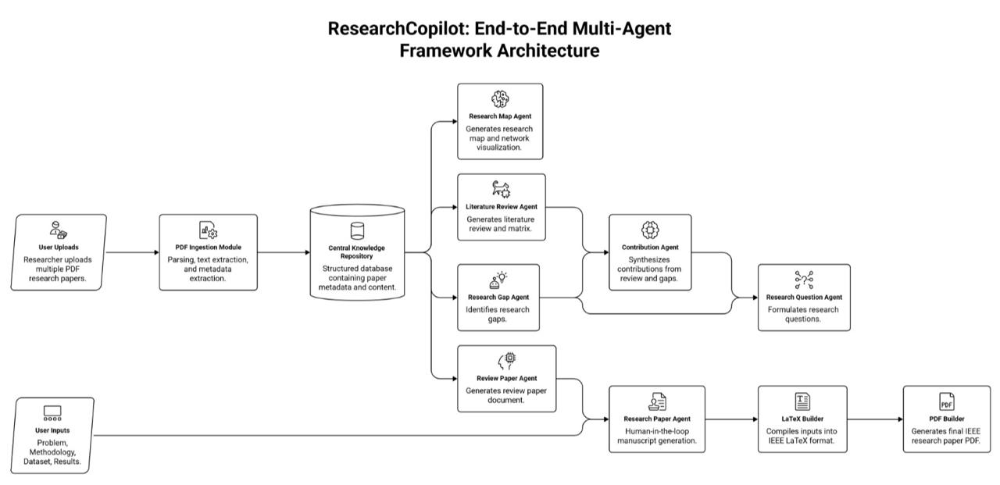

# Research Copilot AI

### Human-in-the-Loop Multi-Agent Framework for Automated Scientific Literature Analysis and Academic Manuscript Generation

Research Copilot AI is a **Human-in-the-Loop (HITL) multi-agent framework** for automated scientific literature analysis and academic manuscript generation.

The framework transforms collections of research papers into structured research knowledge and orchestrates specialized AI agents to perform tasks such as **research landscape analysis, literature review generation, research gap identification, contribution generation, research question formulation, review paper generation, and research paper generation**.

Unlike a conventional single-agent system, Research Copilot AI follows a modular multi-agent architecture in which each agent is responsible for a specific research task and produces structured outputs for subsequent stages. Human validation can be incorporated throughout the workflow to inspect, refine, and approve intermediate results.

---

## Overview

A typical scientific research workflow requires researchers to manually read and analyze large collections of papers, organize findings, compare methodologies, identify research gaps, formulate research questions, and prepare academic manuscripts.

Research Copilot AI aims to support this workflow through an agent-based research pipeline.

The system follows the overall process:

```text
Research Papers (PDF)
        │
        ▼
┌─────────────────────────┐
│ Knowledge Extraction    │
│ & Structured Knowledge  │
│ Base (SKB)              │
└────────────┬────────────┘
             │
             ▼
┌─────────────────────────┐
│ Context Routing /       │
│ Research Knowledge      │
└────────────┬────────────┘
             │
     ┌───────┼────────┐
     ▼       ▼        ▼
 Research  Literature  Research
   Map      Review      Analysis
     │       │          │
     └───────┼──────────┘
             ▼
      Research Gap
             │
             ▼
      Contributions
             │
             ▼
    Research Questions
             │
       ┌─────┴─────┐
       ▼           ▼
 Review Paper  Research Paper
       │           │
       └─────┬─────┘
             ▼
       LaTeX / PDF
```

The framework is designed to keep the research process **structured, modular, traceable, and human-verifiable**.

---

# Key Features

* Automated scientific PDF processing
* Structured Knowledge Base (SKB) generation
* Human-in-the-Loop (HITL) validation
* Multi-agent collaborative workflow
* Context-aware research information routing
* Research landscape analysis
* Literature review generation
* Research gap identification
* Research contribution generation
* Research question generation
* Automated review paper generation
* Automated research paper generation
* Structured JSON outputs
* LaTeX manuscript generation
* PDF document generation
* Runtime evaluation
* Golden-dataset evaluation
* LLM-as-a-Judge evaluation
* Modular and extensible architecture

---

# Technology Stack

| Category              | Technology                           |
| --------------------- | ------------------------------------ |
| Programming Language  | Python                               |
| Agent Framework       | LangGraph                            |
| LLM Framework         | LangChain                            |
| Large Language Models | Qwen3                                |
| Local LLM Runtime     | Ollama                               |
| Retrieval             | Retrieval-Augmented Generation (RAG) |
| Vector Store          | Chroma                               |
| Prompt Engineering    | Structured Prompt Templates          |
| Structured Data       | JSON                                 |
| Scientific Writing    | LaTeX                                |
| Output Formats        | JSON, CSV, LaTeX, PDF                |
| Evaluation            | Golden Dataset + LLM-as-a-Judge      |
| Version Control       | Git, GitHub                          |

---

# System Architecture

<p align="center">
  
</p>

The architecture consists of multiple specialized research agents connected through structured intermediate outputs.

Each stage performs a specific research task rather than relying on a single general-purpose generation step.

---

# Workflow

## Step 1 – Knowledge Extraction

The framework begins by processing scientific research papers in PDF format.

Relevant information is extracted from each paper, including:

* Paper metadata
* Abstract
* Keywords
* Methodology
* Models and algorithms
* Datasets
* Experimental setup
* Evaluation metrics
* Results
* Contributions
* Limitations
* Future work

The extracted information is organized into a **Structured Knowledge Base (SKB)**.

The SKB acts as the central research representation used by downstream agents.

### Output

```text
Structured Knowledge Base
        │
        ├── Paper metadata
        ├── Dataset information
        ├── Methodology
        ├── Models
        ├── Experiments
        ├── Results
        ├── Contributions
        └── Limitations
```

---

## Step 2 – Research Map Agent

The **Research Map Agent** analyzes the Structured Knowledge Base to identify relationships across the collected literature.

It analyzes aspects such as:

* Research domains
* Methodologies
* Datasets
* Models
* Evaluation metrics
* Research themes
* Relationships between studies

The agent also generates a visual representation of the research landscape.

### Outputs

* Research Map — JSON
* Research Map Visualization

---

## Step 3 – Literature Review Agent

The **Literature Review Agent** synthesizes information stored in the Structured Knowledge Base.

It organizes related research and compares existing studies based on aspects such as:

* Research objectives
* Methodologies
* Datasets
* Models
* Experimental results
* Limitations
* Research trends

### Outputs

* Literature Review — JSON
* Literature Review — CSV

---

## Step 4 – Research Gap Agent

The **Research Gap Agent** analyzes the surveyed literature to identify:

* Limitations in existing studies
* Unresolved challenges
* Methodological limitations
* Inconsistencies across studies
* Underexplored research areas
* Potential future research directions

### Outputs

* Research Gaps
* Open Challenges
* Future Research Directions

---

## Step 5 – Contribution Agent

The **Contribution Agent** uses the literature analysis and identified research gaps to propose potential research contributions.

### Inputs

* Literature Review
* Research Gaps

### Outputs

* Proposed Contributions
* Potential Research Ideas
* Expected Research Impact

The generated contributions are intended to assist researchers in developing research directions and should be evaluated by the researcher before being adopted.

---

## Step 6 – Research Question Agent

The **Research Question Agent** formulates research questions and objectives using the identified research gaps and proposed contributions.

### Inputs

* Research Gaps
* Proposed Contributions

### Outputs

* Research Questions
* Research Objectives
* Research Hypotheses

---

## Step 7 – Review Paper Agent

The **Review Paper Agent** uses the Structured Knowledge Base and literature analysis to generate a complete review-paper draft.

### Outputs

* Review Paper — JSON
* Review Paper — LaTeX
* Review Paper — PDF

---

## Step 8 – Research Paper Agent

The **Research Paper Agent** generates a research manuscript using the generated research knowledge together with user-provided information such as:

* Research methodology
* Dataset
* Experimental setup
* Models
* Results
* Evaluation

The agent can generate the manuscript in structured and document formats.

### Outputs

* Research Paper — JSON
* Research Paper — LaTeX
* Research Paper — PDF

---

# Human-in-the-Loop (HITL)

Research Copilot AI incorporates a **Human-in-the-Loop** approach to support researcher verification.

Researchers can inspect, edit, approve, or refine intermediate outputs before they are passed to downstream stages.

For example:

```text
Agent Output
     │
     ▼
Human Review
     │
 ┌───┴────┐
 │        │
Approve  Modify
 │        │
 └───┬────┘
     ▼
Next Agent
```

This approach is particularly important for academic applications where generated information, research gaps, contributions, and manuscript content require human verification.

---

# Project Structure

```text
Research-Copilot/
│
├── backend/
│   │
│   ├── Agents/
│   │   ├── contributions_agent.py
│   │   ├── literature_review_agent.py
│   │   ├── research_gap_agent.py
│   │   ├── research_map_agent.py
│   │   └── research_question_agent.py
│   │
│   ├── Document_Agents/
│   │   ├── latex_builder.py
│   │   ├── latex_research.py
│   │   ├── pdf_builder.py
│   │   ├── pdf_research.py
│   │   ├── research_paper_agent.py
│   │   └── review_paper_agent.py
│   │
│   ├── File process/
│   │   └── pdf_reader.py
│   │
│   ├── Results/
│   │   ├── evaluation.py
│   │   └── evaluation_document.py
│   │
│   └── SKB/
│       ├── context_router.py
│       ├── ground_truth.py
│       └── Review_base.py
│
├── llm_judge/
│   ├── ground_truth/
│   │   ├── paper1.json
│   │   ├── paper2.json
│   │   ├── ...
│   │   └── paper10.json
│   │
│   ├── skb/
│   │   ├── paper1.json
│   │   ├── paper2.json
│   │   ├── ...
│   │   └── paper10.json
│   │
│   ├── results/
│   │   ├── field_level_summary.csv
│   │   ├── golden_dataset_eval_results.csv
│   │   └── golden_dataset_eval_results.json
│   │
│   └── judge.py
│
├── framework.jpeg
├── requirements.txt
├── README.md
├── .gitignore
│
├── uploads/       # Local research-paper inputs (ignored)
├── output/        # Generated experiment outputs (ignored)
└── venv/          # Local virtual environment (ignored)
```

---

# Evaluation

Research Copilot AI includes a dedicated evaluation pipeline for assessing the quality of the structured information generated from research papers.

The evaluation framework uses a **golden dataset** containing manually prepared reference information and compares it with the corresponding Structured Knowledge Base outputs.

## Evaluation Workflow

```text
              Research Paper
                    │
          ┌─────────┴─────────┐
          ▼                   ▼
   Ground Truth            SKB Output
          │                   │
          └─────────┬─────────┘
                    ▼
             LLM-as-a-Judge
                    │
                    ▼
            Field-Level Scores
                    │
                    ▼
           Evaluation Summary
```

The current evaluation setup contains reference annotations and corresponding SKB outputs for **10 papers**.

---

## Golden Dataset

The manually prepared reference data is stored in:

```text
llm_judge/ground_truth/
```

Example:

```text
paper1.json
paper2.json
...
paper10.json
```

These files serve as the reference against which the generated structured knowledge is evaluated.

---

## LLM-as-a-Judge

The repository contains an LLM-based evaluation implementation:

```text
llm_judge/judge.py
```

The evaluator compares the generated SKB against the corresponding ground-truth information.

The evaluation is performed at the **field level**, allowing individual research attributes to be analyzed rather than relying only on a single overall score.

Examples of evaluated information include:

* Dataset
* Participants / samples
* Methodology
* Models
* Experimental setup
* Evaluation metrics
* Results
* Contributions
* Limitations
* Other structured research attributes

---

## Evaluation Results

The evaluation outputs are stored in:

```text
llm_judge/results/
```

### Available files

```text
field_level_summary.csv
golden_dataset_eval_results.csv
golden_dataset_eval_results.json
```

These files contain the results generated by the evaluation pipeline and can be used to inspect both aggregate and field-level performance.

The repository therefore contains not only the evaluation code but also the corresponding evaluation artifacts.

> Exact evaluation values should be read from the result files rather than inferred from the README. This keeps the documentation consistent with the actual experimental results.

---

# Runtime Evaluation

In addition to output-quality evaluation, the project includes runtime evaluation components under:

```text
backend/Results/
```

The runtime evaluation can be used to measure the execution time of different stages of the research pipeline.

Representative stages include:

* Knowledge-base construction
* Research Map generation
* Literature Review generation
* Research Paper generation

This provides an additional perspective on the computational cost of the automated workflow.

---

# Installation

## 1. Clone the Repository

```bash
git clone https://github.com/Umaima-Tanveer/Research-Copilot.git
cd Research-Copilot
```

---

## 2. Create a Virtual Environment

### macOS / Linux

```bash
python3 -m venv venv
source venv/bin/activate
```

### Windows

```bash
python -m venv venv
venv\Scripts\activate
```

---

## 3. Install Dependencies

```bash
pip install -r requirements.txt
```

---

# Local LLM Setup

Research Copilot AI uses **Ollama** for local LLM inference.

Install Ollama and make sure the required model is available.

For example:

```bash
ollama pull qwen3:8b
```

Verify the installed model:

```bash
ollama list
```

If Ollama is not already running:

```bash
ollama serve
```

The model configuration can be adjusted in the corresponding project files depending on the experiment and available hardware.

---

# Configuration

Some components, particularly the evaluation pipeline, may require environment variables or API configuration.

Sensitive configuration should be stored in a local `.env` file.

Example:

```text
llm_judge/
└── .env
```

The `.env` file is intentionally excluded from Git.

**Do not commit API keys, passwords, tokens, or other credentials to the repository.**

A safe example configuration can be provided using:

```text
.env.example
```

without including actual secrets.

---

# Input Data

Research papers can be supplied locally through:

```text
uploads/
```

For example:

```text
uploads/
├── Run1/
│   ├── paper1.pdf
│   ├── paper2.pdf
│   └── ...
│
└── Run2/
    ├── paper1.pdf
    └── ...
```

The `uploads/` directory is excluded from Git because research-paper collections can be large and may contain copyrighted material.

Users should provide their own legally obtained research papers when reproducing experiments.

---

# Running the System

The framework is organized into multiple processing stages.

A typical execution flow is:

```text
PDF Input
    ↓
Knowledge Extraction
    ↓
Structured Knowledge Base
    ↓
Research Map
    ↓
Literature Review
    ↓
Research Gap
    ↓
Contributions
    ↓
Research Questions
    ↓
Review Paper / Research Paper
    ↓
LaTeX
    ↓
PDF
```

Individual components can be executed using Python from the project environment.

For example:

```bash
python backend/Agents/research_map_agent.py
```

and:

```bash
python backend/Agents/literature_review_agent.py
```

The exact execution order may depend on the configured workflow and experimental setup.

---

# Running the Evaluation

The LLM-as-a-Judge evaluation can be executed using:

```bash
python llm_judge/judge.py
```

Evaluation outputs are generated under:

```text
llm_judge/results/
```

The evaluation results can then be inspected using the generated CSV or JSON files.

---

# Output Structure

Generated outputs can contain structured research information and complete document artifacts.

A typical output structure is:

```text
output/
│
├── SKB.json
│
├── research_map.json
├── research_map_visualization.png
│
├── literature_review.json
├── literature_review.csv
│
├── research_gap.json
├── contribution.json
├── research_questions.json
│
├── review_paper.json
├── review_paper.tex
├── review_paper.pdf
│
├── research_paper.json
├── research_paper.tex
└── research_paper.pdf
```

The exact files generated depend on the workflow and experiment being executed.

The `output/` directory is ignored by Git because generated artifacts can be large and experiment-specific.

---

# Applications

Research Copilot AI can support a range of research activities, including:

* Scientific literature review
* Survey paper preparation
* Academic writing assistance
* Research planning
* Research landscape analysis
* Research gap discovery
* Knowledge extraction from scientific papers
* Research question formulation
* Research proposal development
* Research documentation
* Graduate and doctoral research support

---

# Research Design Philosophy

Research Copilot AI is designed around four main principles:

### 1. Structured Research Knowledge

Research information is represented in structured form before being used for downstream generation.

### 2. Specialized Agents

Different research tasks are handled by dedicated agents rather than a single general-purpose agent.

### 3. Human Verification

Researchers remain involved in reviewing and refining generated information.

### 4. Evaluation

The system includes dedicated evaluation components to measure the quality of structured knowledge extraction and analyze runtime behavior.

---

# Reproducibility

To reproduce the project:

### Step 1

Create and activate the Python environment.

```bash
python3 -m venv venv
source venv/bin/activate
```

### Step 2

Install dependencies.

```bash
pip install -r requirements.txt
```

### Step 3

Install and configure Ollama.

```bash
ollama pull qwen3:8b
```

### Step 4

Provide the required research-paper PDFs inside:

```text
uploads/
```

### Step 5

Run the required processing stages.

### Step 6

Inspect generated files under:

```text
output/
```

### Step 7

Run the evaluation pipeline:

```bash
python llm_judge/judge.py
```

### Step 8

Inspect the evaluation results:


llm_judge/results/


---

# Limitations

The current implementation has several limitations:

* The quality of generated knowledge depends on the quality and completeness of the input papers.
* LLM-generated outputs may contain extraction or interpretation errors.
* Different LLM models can produce different outputs.
* Local LLM inference can require substantial computational resources.
* Generated research gaps and contributions require human verification.
* Automated manuscript generation does not replace expert academic review.
* The current golden-dataset evaluation covers a limited number of papers.
* Generated manuscripts should be reviewed and validated before submission or publication.

---

# Future Work

Potential future extensions include:

* Larger and more diverse golden datasets
* Evaluation across additional research domains
* Multi-model evaluation
* Improved retrieval and context routing
* Citation verification
* Hallucination detection
* Human evaluation alongside automated evaluation
* More advanced agent coordination
* Improved long-document processing
* Research-paper comparison and visualization
* Integration with scholarly literature databases
* Improved reproducibility and experiment tracking

---

# Repository Guidelines

The following directories are intentionally excluded from version control:

venv/
uploads/
output/
.env


### `venv/`

Local Python virtual environment.

### `uploads/`

User-provided research papers and experimental input data.

### `output/`

Generated research maps, JSON files, LaTeX documents, PDFs, and other experiment-specific artifacts.

### `.env`

Local environment variables and sensitive configuration.

The repository therefore focuses on the **source code, evaluation methodology, evaluation artifacts, and core project documentation**.

---

# Academic Use

Research Copilot AI is intended as a **research assistance framework**.

Generated information and manuscripts should be treated as research-support outputs and should be independently verified by the researcher before being used in academic publications.

Particular attention should be given to:

* Factual correctness
* Dataset and experimental details
* Numerical results
* Citations
* Research gaps
* Claimed contributions
* References
* Generated manuscript content

---

# Citation

If you use Research Copilot AI in academic work, please cite the associated publication when available.


Umaima Tanveer.
Research Copilot AI: A Human-in-the-Loop Multi-Agent Framework
for Automated Scientific Literature Analysis and Academic Manuscript Generation.


Citation information will be updated once the associated publication is finalized.

---

# Author

**Umaima Tanveer**

B.E. Artificial Intelligence and Machine Learning
BGS College of Engineering and Technology, Bengaluru

### Research Interests

* Artificial Intelligence
* Machine Learning
* Retrieval-Augmented Generation
* Large Language Models
* Agentic AI
* Natural Language Processing
* AI-assisted Scientific Research

---

# License

This project is currently intended for **research and educational purposes**.

A formal open-source license can be added to the repository based on the intended distribution and usage of the project.
